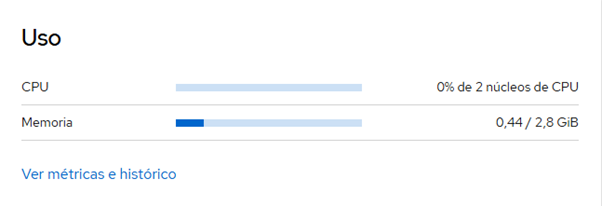

# DOCUMENTACION ADMNISTRACION REMOTA ASO EN WAC Y COCKPIT

## ***WINDOWS ADMIN CENTER (WAC)***

| Sistema administrado   | Herramienta           | Protocolo | Puerto |
|------------------------|-----------------------|-----------|--------|
| Windows Server 2025    | Windows Admin Center  | HTTPS     | 6600   |

### **WAC ACCESO**

Aqui podemos ver que para meternos dentro del WAC, al ejecutar la aplicacion nos llevara la buscador para meter el usuario y la contraseña de la maquina que estamos utilizando. En la barra vemos la URL que hemos utilizado para entrar en el WAC, nombre del host:puerto.

### **WAC SERVIDOR**

Una vez dentro de la WAC ahora tenemos que añadir el servidor a la WAC, para ello en agregar elegimos servidor y ponemos su direccion IP, despues elegimos entrar con creedenciales donde pondremos el usuario y contraseña administrador del servidor. Una vez añadido podremos ver que sale como servidor.

Nos metemos dentro del servidor y observamos desde informacion general, que podemos ver gasto en tiempo real de la CPU Y RAM, informacion varia del sistema, etc.

## ***COCKPIT***

| Sistema              | Usuario remoto | Herramienta | Protocolo | Puerto |
|----------------------|---------------|-------------|-----------|--------|
| Ubuntu Server 24.04  | usercockpit   | Cockpit     | HTTPS     | 9090   |

### **COCKPIT SERVICIO**

Después de instalar el cockpit comprobamos su estado con un systemctl status cockpit, aparecerá inactivo y tendremos que arrancarlo.

### **COCKPIT SERVICIO**

Ahora tenemos que crear otro usuario cualquiera para utilizarlo en la conexion remota en cockpit desde el Windows 11

### **COCKPIT MONITORIZACION**

Después de conectarnos al cockpit, en la informacion general veremos el gasto en CPU Y RAM, como pide el ejercicio
