# Práctica 2 – UT4  
## Administración remota de sistemas en red  
**Curso 2025/2026 – ASO**

## Infraestructura utilizada

- **Servidor Linux:** Ubuntu Server 24.04  
- **Servidor Windows:** Windows Server 2025  
- **Equipo administrador:** Windows 11  
- **Red:** Red privada  
- **Cliente SSH:** PuTTY  
- **Protocolo gráfico remoto:** RDP  

Todas las conexiones se realizan desde el equipo **Windows 11**.

## Parte 1 – Acceso remoto seguro por SSH

### Configuración realizada

- **Servicio:** SSH  
- **Servidor:** Ubuntu Server 24.04  
- **Usuario autorizado:** `remoto_ssh`  
- **Cliente:** PuTTY (Windows 11)  
- **Autenticación:** Clave pública  
- **Acceso por contraseña:** Deshabilitado  
- **Usuarios no autorizados:** Acceso denegado  

La conexión SSH se realiza exclusivamente mediante clave pública, utilizando un usuario dedicado creado únicamente para este propósito.

### Evidencias

1.	Usuario creado

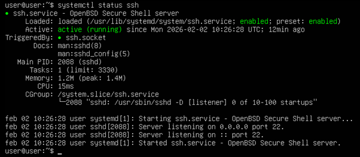
   
3.	Servicio SSH activo

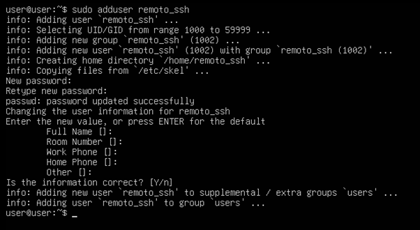

4.	Claves generadas. Captura donde se vean las claves generadas en el directorio final con los permisos adecuados.

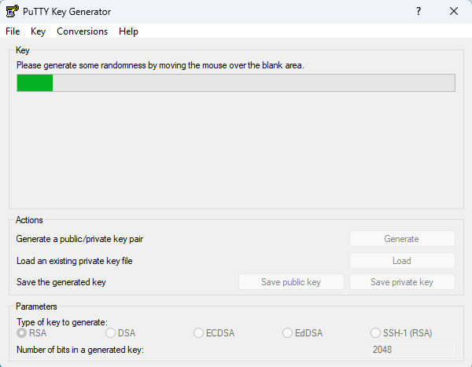

Publica

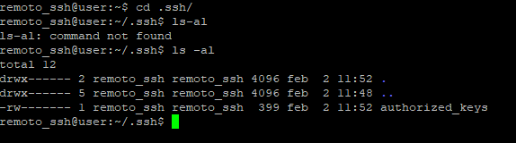

Privada

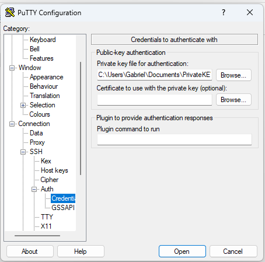

5.	Acceso por contraseña deshabilitado.

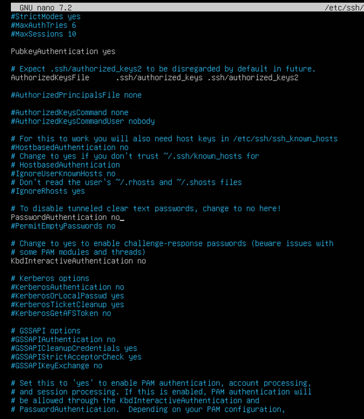

7.	Acceso SSH desde PuTTY con remoto_ssh.

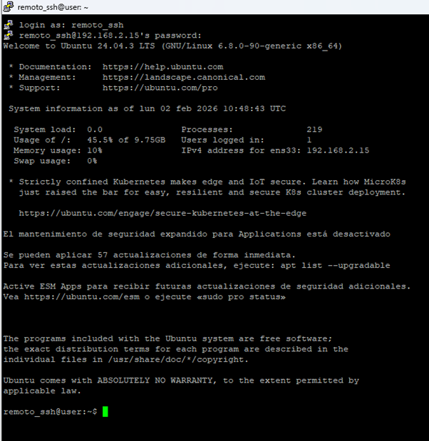

8.	Acceso denegado a otro usuario. Captura del intento fallido con un usuario distinto de remoto_ssh.

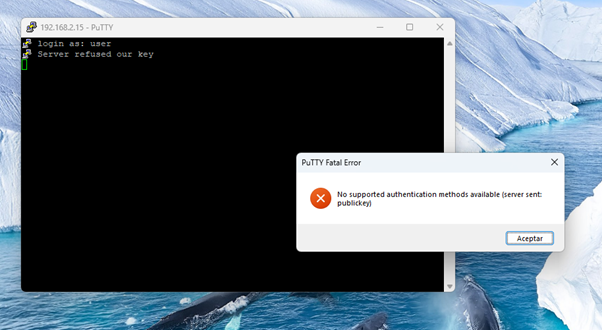

## Parte 2 – Administración remota gráfica (RDP)

### Configuración realizada

- **Sistema administrado:** Windows Server 2025  
- **Protocolo:** RDP  
- **Usuario RDP:** `remoto_rdp`  
- **Grupo de acceso:** Usuarios de Escritorio remoto  
- **Autenticación de nivel de red (NLA):** Habilitada  
- **Cifrado:** Sí  
- **Usuarios no autorizados:** Acceso denegado  

El acceso remoto gráfico se realiza únicamente mediante un usuario dedicado, con control explícito de permisos y seguridad reforzada mediante NLA.

### Evidencias

1.	Usuario remoto_rdp creado y añadido al grupo. Captura donde se vea el usuario dentro del grupo Usuarios de Escritorio remoto.

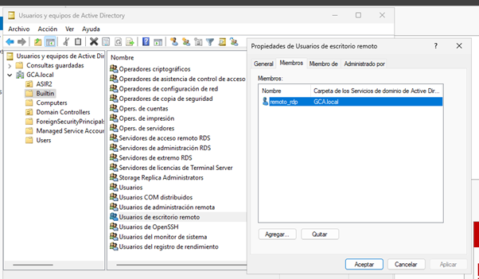

2.	Autenticación de nivel de red para la conexión habilitada.

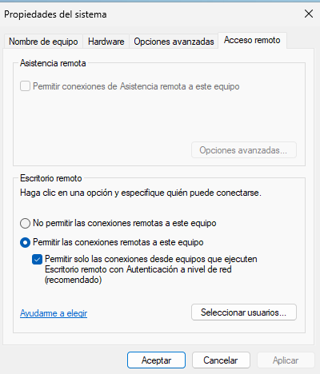

3.	Sesión RDP activa donde se vea escritorio del servidor y usuario remoto_rdp conectado.

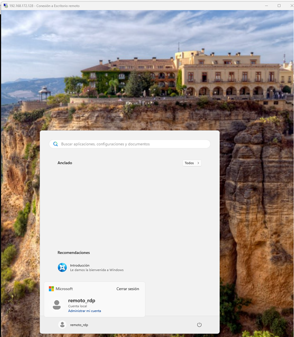

4.	Acceso denegado a otro usuario. Captura del intento fallido con un usuario distinto de remoto_rdp.

