# 📘 Documentación – Práctica UT5 Automatización

## Tarea 1: Mapeo automático de unidades

---

###  Carpetas compartidas

Se han creado las siguientes carpetas en `C:\Compartidas`:

- **Admin → Compartida-Admin**
- **Informatica → Compartida-Info**
- **Comun → Compartida-Todos**

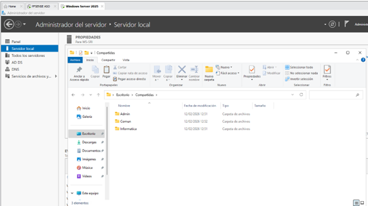

---

###  Permisos

Se han configurado permisos tanto en compartir como en seguridad:

- **Compartida-Admin** → Solo el grupo `GRP_Administracion`
- **Compartida-Info** → Solo el grupo `GRP_Informatica`
- **Compartida-Todos** → Todos los usuarios

Se aplica el principio de **mínimo privilegio**, permitiendo acceso solo a los recursos necesarios.

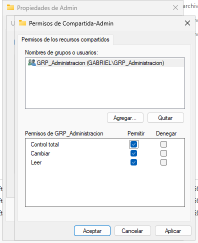

---

###  GPO creada

Nombre de la GPO:

Mapeo-Unidades-[GCA]

Configuración:

- Unidad **Z:** → `\\servidor\Compartida-Admin` (Administración)
- Unidad **Y:** → `\\servidor\Compartida-Info` (Informática)
- Unidad **X:** → `\\servidor\Compartida-Todos` (Todos)

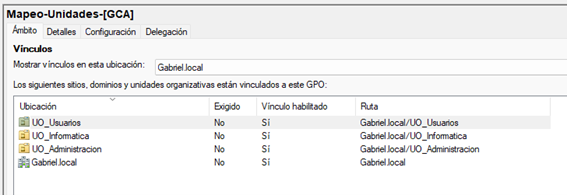

---

###  Segmentación

Se ha utilizado **Item-level targeting** para asignar las unidades según el grupo:

- Administración → Z:
- Informática → Y:
- Todos → X:

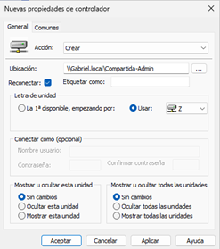

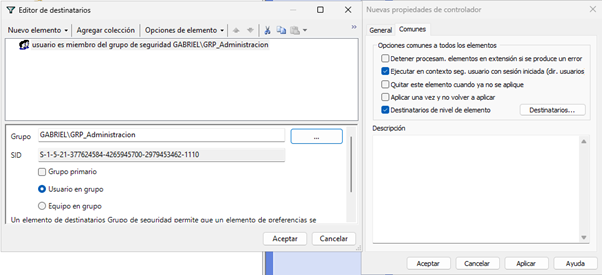

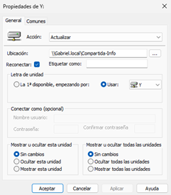

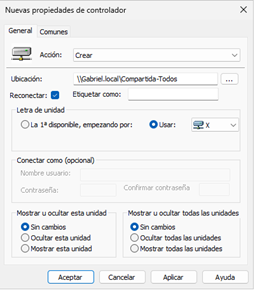

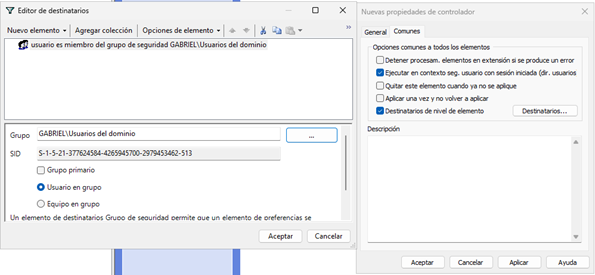

---

###  Verificación

Se han realizado pruebas con distintos usuarios:

- Usuario de Administración → ve Z: y X:
- Usuario de Informática → ve Y: y X:

Además, al intentar acceder a recursos no permitidos se obtiene **acceso denegado**.

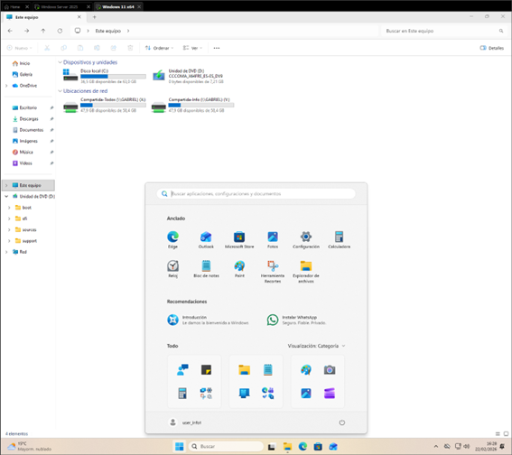

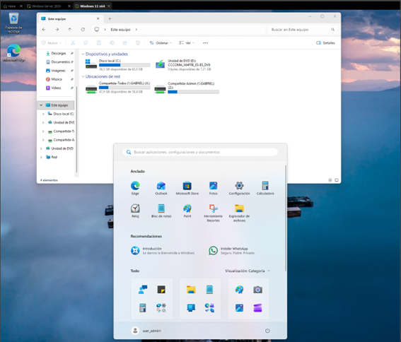

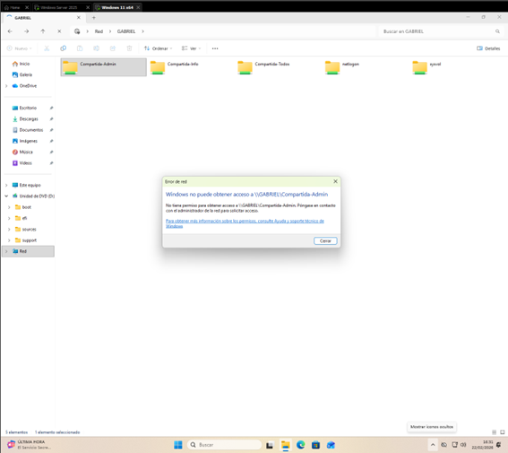

---

## 🔹 Tarea 2: Script de limpieza automático

###  Descripción

En esta tarea se ha creado un script de PowerShell que elimina archivos temporales y genera un log, y se ha desplegado automáticamente mediante una GPO.

---

###  Script

El script realiza:

- Limpieza de archivos temporales
- Ejecución automática sin intervención del usuario
- Generación de un archivo de log

---

###  Despliegue

El script se ha guardado en:

\[Gabriel.local].local\SYSVOL[Gabriel.local]\scripts\

Esto permite que todos los equipos del dominio puedan acceder a él.

---

###  GPO creada

Nombre:

Mantenimiento-Automatico-[GCA]

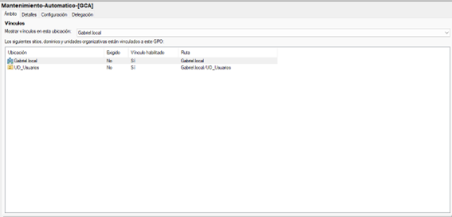

Configuración:

- Tarea programada
- Ejecución semanal
- Ejecutada con la cuenta **SYSTEM**
- Con privilegios elevados
- Ejecuta el script de PowerShell desde SYSVOL

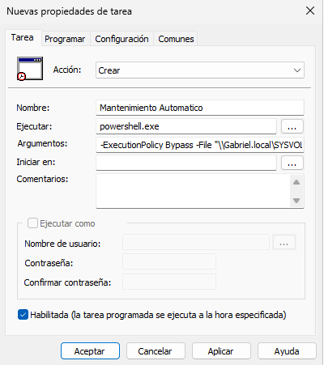

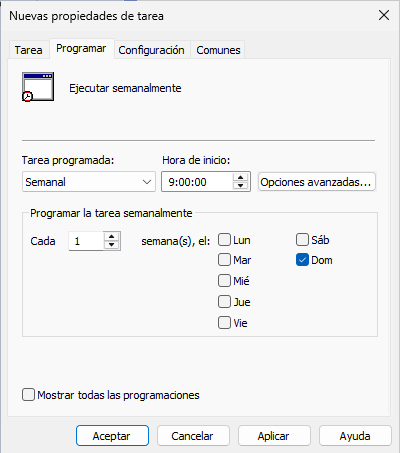

---

###  Verificación

En el equipo cliente:

- Se ha ejecutado `gpupdate /force`
- Se ha comprobado la tarea en el programador (`taskschd.msc`)
- Se ha ejecutado manualmente la tarea
- Se ha verificado la creación del log

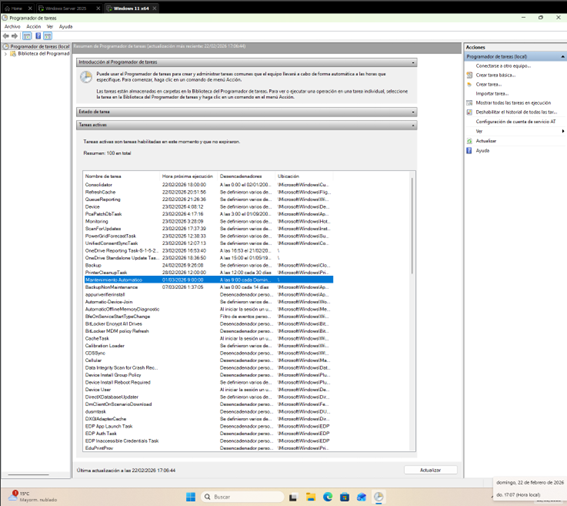

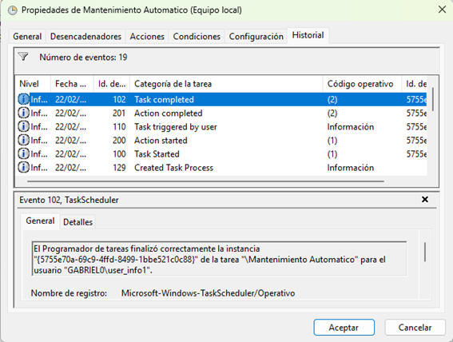

---

###  Log

El script genera un archivo en:

C:\Logs\limpieza.log

Donde se registra la ejecución del script.

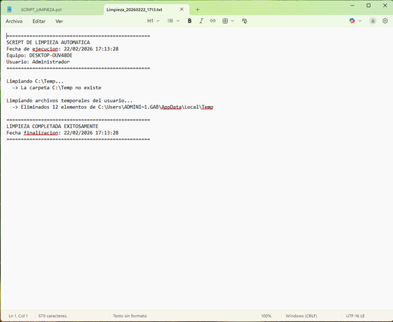
